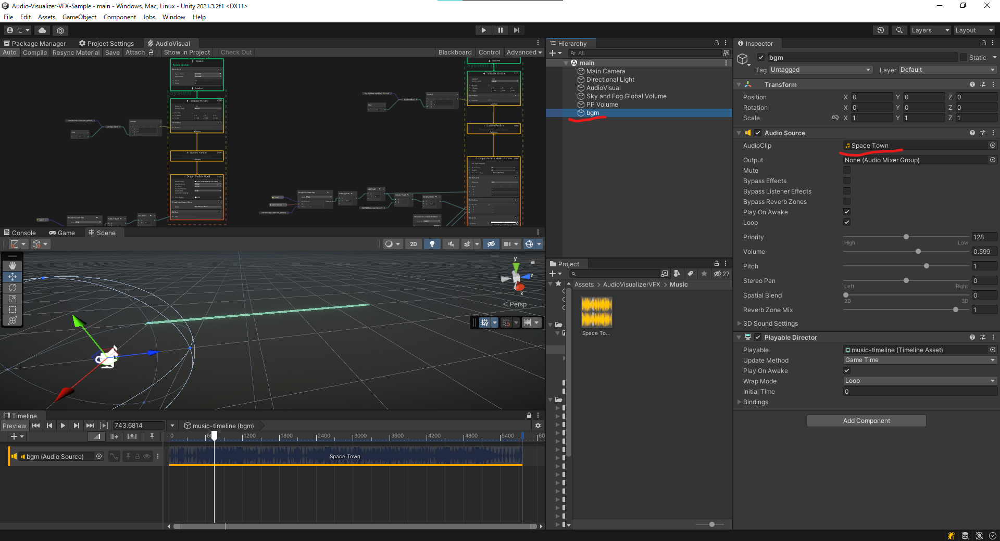

# Audio-Visualizer-VFX-Sample

## About

VFX Graph を用いて Audio Visualizer を作るサンプル。

https://user-images.githubusercontent.com/11372210/168031755-bbe54f0b-ce11-40a4-bf4f-953a58031d04.mp4

## Tested Environment

- Windows 10 Home
- Unity 2021.3.2f1
- HDRP
- Visual Effect Graph 12
- Metatex

## Usage

1. 死よしたい音源データをUnityにインポート
2. `Assets\AudioVisualizerVFX\Scenes\main.unity`を開く
3. bgmオブジェクトのAudio Sourceにインポートした音源データをAudioClipとしてアタッチ

## Credits

- サンプル使用音楽（リポジトリには含まれません）：[Space Town (Brand New Mix) / Khaim](https://dova-s.jp/bgm/play4000.html)
- Metatex：[GitHub](https://github.com/keijiro/Metatex)

## Contact

何かございましたら[にー兄さんの Twitter](https://twitter.com/ninisan_drumath)
までご連絡ください。
